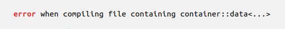
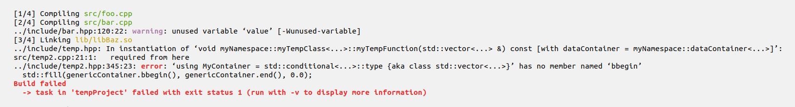
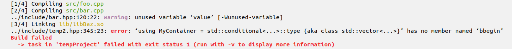

## Introduction

The goal of this program is to take an input from the command line, either by piping the output of a program through
the parser or by listening to the output of a program and format the output according to specific rules that are
defined through a JSON input file.

## Installation

To compile the praser, simply run

```bash
make
```

and you should be good to go. Note that this requires a C++ compiler that is compatible with the 2014 C++ standard.

## Run

To use the parser on a static text file, you can use the following syntax

```bash
cat textFileToParse | /path/to/parser -f /path/to/inputFile.json
```

Alternatively you can run the parser on the output of a different program to parse its output

```bash
/path/to/programm | /path/to/parser -f /path/to/inputFile.json
```

## Command line arguments

The following command line arguments are supported

- **-h**,**--help** Prints the help with short description of argumentes and usage
- **-f**,**--file** Path to the `JSON` input file. Without this the parser will effectively just print the text that it
receives.
- **-k**,**--keywordsOnly** Only print string to screen if it contains one of the keywords specified in the `JSON` file.
This is usefull if a lot of additional lines are printed that are difficult or cumersome to surpress through the
`ignoreCompleteLineIfItContainsSubstring` property (see [JSON file explanation](#input-file-for-formating-text))

## Input file for formating text

The following shows the basic structure of the input file with simple examples, provided in `JSON` format

```json
{
  "ignoreCompleteLineIfItContainsSubstring" : [
    "should be surpressed"
  ],
  "ignoreContentBetweenDelimiter" : [
    {
      "startingDelimiter" : "<",
      "endingDelimiter" : ">",
      "replaceContentBy" : "..."
    }
  ],
  "styleLineContainingKeywords" : [
    {
      "keyword" : "error",
      "removeDuplicates" : true,
      "applyStyle" : "onKeyword",
      "color" : "red",
      "style" : "bold"
    }
  ]
}
```

Suppose the above is stored as "example.json", consider the following example

```bash
name@pc:~$ printf "This string should be surpressed\nerror when compiling file containing container::data<std::vector<int>, std::vector<double>>\nerror when compiling file conng container::data<std::vector<int>, std::vector<double>>\n" > log
name@pc:~$ cat log
This string should be surpressed
error when compiling file containing container::data<std::vector<int>, std::vector<double>>
error when compiling file containing container::data<std::vector<int>, std::vector<double>>
name@pc:~$ cat log | /path/to/parser -f /path/to/example.json
```



There are 3 sections that can be specified in the input file, which are

- `ignoreCompleteLineIfItContainsSubstring`: In here comes a list of all strings that should be removed from the output.
A string will be removed from the output as long as parts of the string match one of the statesments in this list.

- `ignoreContentBetweenDelimiter`: This property defines delimiters which are used to surpress content between those
delimiters. Unlike the `ignoreCompleteLineIfItContainsSubstring` property, this only acts locally on strings between the
delimiter. Furthermore, we can provide two additional arguments `replaceContentBy` and `mustContain`, which provide
fine grained control over the content between the delimiters.
  - `replaceContentBy` defines the string which will be printed instead of the actual content between the delimtiers, if
  this entry is not provided, it will default to "...".
  - `mustContain` specifies a string that must be included between the delimiters if the content is to be replaced. This
  is useful if there are several delimiters of the same type but with different content between those. Regular
  expressions are currently not allowed for performance reasons.

- `styleLineContainingKeywords` This list defines keywords and how they should be formated when printed to screen. In
the above example the keyword is `error`, which should be printed in `red` using a `bold` formating for the text. A
complete list of allowed entries is as follows:
  - `keyword` This is the keyword to be matched. If the `keyword` is encountered in a string, the line will be formated
  according to the parameters set for this `keyword`.
  - `removeDuplicates` A boolean flag indicating if duplicate entries should be shown or removed from the output. This
  is useful for cyclig dependencies where the same message may be printed more than once. As shown in the example above,
  strings that are identical will not be printed twice if this flag is set to true.
  - `applyStyle` This entry determines how the formating should be applied to the line, specifically, it determines
  which portion of the string are colored and formated. The following entries are supported:
    - `preKeyword` Everything before the `keyword` will be formated.
    - `onKeyword` Only the `keyword` will be formated.
    - `postKeyword` Everything after the `keyword` will be formated.
    - `everywhere` Everything will be formated, as long as the string contains the `keyword`.
  - `color` This is the color which the text should take, the following colors are supported:
    - `neutral` (default background color)
    - `red`
    - `green`
    - `yellow`
    - `blue`
    - `magenta`
    - `cyan`
  - `format` This is the formating that should be applied to the text, the following entries are supported:
    - `normal` (default text formating)
    - `bold`
    - `dim` (darker than base color)
    - `underline`
    - `blink` (flashing text)

## Example

now let's consider a small but real life example. Suppose we have the following file that we want to put through the
parser:

```
[1/4] Compiling src/foo.cpp
[2/4] Compiling src/bar.cpp
/home/user/project/include/bar.hpp:107: warning: argument 'value' of command @param is not found in the argument list
../include/bar.hpp:120:22: warning: unused variable ‘value’ [-Wunused-variable]
[3/4] Linking lib/libBaz.so
../include/temp.hpp: In instantiation of ‘void myNamespace::myTempClass<myContainerType>::myTempFunction(std::vector<dataContainer> &) const [with dataContainer = myNamespace::dataContainer<std::map<int, std::string>, std::vector<std::array<myArray<double, specialisedDataContainer<std::vector<double>>>>, 3>>]’:
src/temp2.cpp:21:1:   required from here
../include/temp2.hpp:345:23: error: ‘using MyContainer = std::conditional<true, std::vector<double>, std::vector<int> >::type {aka class std::vector<double>}’ has no member named ‘bbegin’
  std::fill(genericContainer.bbegin(), genericContainer.end(), 0.0);
Build failed
  -> task in 'tempProject' failed with exit status 1 (run with -v to display more information)
```

and we have a corresponding input file like so:

```json
{
  "ignoreCompleteLineIfItContainsSubstring" : [
    "is not found in the argument list"
  ],
  "ignoreContentBetweenDelimiter" : [
    {
      "startingDelimiter" : "<",
      "endingDelimiter" : ">",
      "replaceContentBy" : "..."
    }
  ],
  "styleLineContainingKeywords" : [
    {
      "keyword" : "warning",
      "gatherStatistics" : true,
      "removeDuplicates" : true,
      "applyStyle" : "onKeyword",
      "color" : "magenta",
      "style" : "bold"
    },
    {
      "keyword" : "error",
      "removeDuplicates" : true,
      "applyStyle" : "onKeyword",
      "color" : "red",
      "style" : "bold"
    },
    {
      "keyword" : "Compiling",
      "applyStyle" : "postKeyword",
      "color" : "green"
    },
    {
      "keyword" : "Linking",
      "applyStyle" : "postKeyword",
      "color" : "yellow"
    },
    {
      "keyword" : "Build failed",
      "applyStyle" : "everywhere",
      "color" : "red",
      "style" : "bold"
    },
    {
      "keyword" : "failed with exit status",
      "applyStyle" : "everywhere",
      "removeDuplicates" : true,
      "color" : "red",
      "style" : "bold"
    }
  ]
}
```

Running the above text through the parser using

```bash
user@pc:~$ cat /path/to/logFile | /path/to/parser -f /path/to/inputFile.json
```

will result in the following output:



We may further wish to surpress clutter by only printing strings that contain keywords. We use the `-k` command line
argument for this. Thus, our command becomes

```bash
user@pc:~$ cat /path/to/logFile | /path/to/parser -k -f /path/to/inputFile.json
```

and our output



